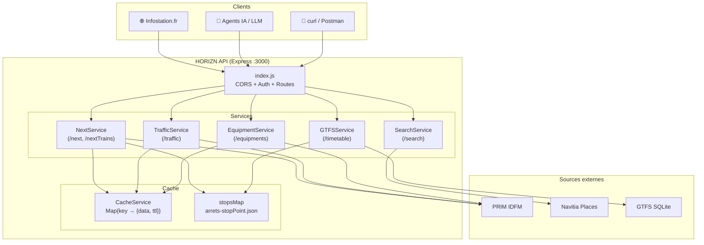
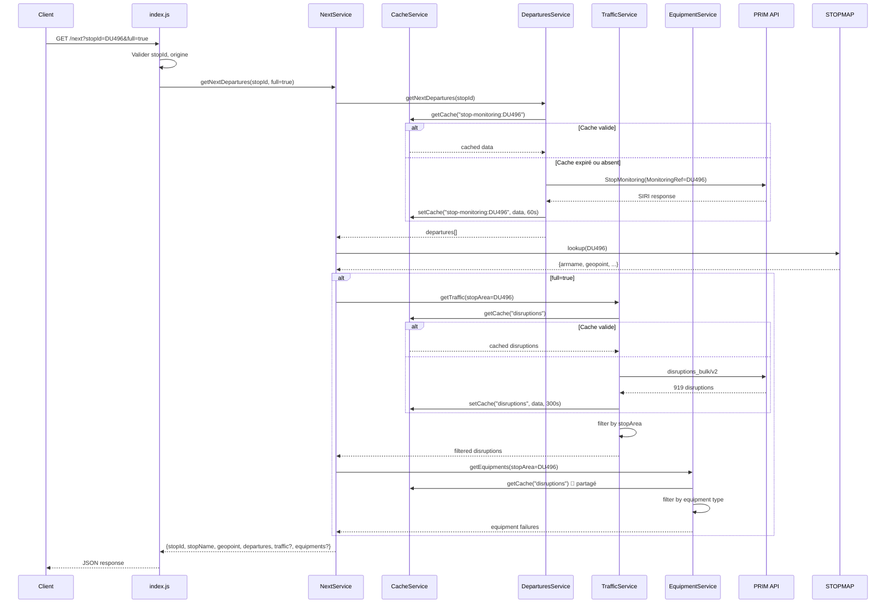

# HORIZN — Architecture & Flux

---

## 1. Arborescence du projet

```
HORIZN/
├── js/
│   ├── index.js                    ← Point d'entrée Express, routes, middlewares
│   ├── constants.js                ← Énumérations (statuts, causes, opérateurs)
│   ├── cache/                      ← Cache mémoire (fichiers temporaires)
│   ├── img/                        ← Assets image
│   ├── scripts/                    ← Scripts utilitaires (setup-gtfs, etc.)
│   └── services/
│       ├── CacheService.js         ← Cache mémoire générique avec TTL
│       ├── DeparturesService.js    ← Fusion GTFS + PRIM StopMonitoring
│       ├── NextService.js          ← Orchestrateur /next avec mode full
│       ├── GTFSService.js          ← SQLite GTFS statique
│       ├── TrafficService.js       ← disruptions_bulk → filtré par lineRef/stopId
│       ├── EquipmentService.js     ← disruptions_bulk → filtres équipements
│       └── SearchService.js        ← Navitia places API
├── json/
│   └── arrets-stopPoint.json       ← Référentiel des arrêts (~18 Mo, .gitignoré)
├── docs/
│   ├── GEO.md                      ← Référence géographique complète
│   └── ARCHITECTURE.md             ← Ce fichier
├── .env.example                    ← Template de configuration
├── .gitignore
├── readme.md                       ← Documentation utilisateur / API
├── package.json
└── robots.txt
```

---

## 2. Flux de données

### 2.1 Diagramme général



### 2.2 Flux détaillé : `/next?stopId=DU496&full=true`



### 2.3 Flux détaillé : `/traffic?lineRef=C01739`

```mermaid
sequenceDiagram
    participant C as Client
    participant I as index.js
    participant TS as TrafficService
    participant CS as CacheService
    participant P as PRIM API

    C->>I: GET /traffic?lineRef=C01739
    I->>I: Valider paramètres (lineRef ou stopId)
    I->>TS: getLineTraffic("C01739")
    TS->>CS: getCache("disruptions")
    
    alt Cache valide
        CS-->>TS: 919 disruptions (tout le dataset)
    else Cache expiré
        TS->>P: GET /marketplace/disruptions_bulk/disruptions/v2
        P-->>TS: 919 disruptions
        TS->>CS: setCache("disruptions", data, 300s)
    end
    
    TS->>TS: filter(lineId contains "C01739")
    note right: Filtrage côté serveur<br/>Car l'API ne supporte pas<br/>de paramètre de filtre
    TS-->>I: {lineRef, count: 12, messages: [...]}
    I-->>C: JSON response
```

---

## 3. Services détaillés

### 3.1 CacheService.js

Cache mémoire générique avec TTL configurable.

```javascript
// Interface
get(key)        → data || null
set(key, data, ttlSeconds) → void
// Stockage : Map<string, {data, expiry}>
// TTL par défaut : 60s
// Nettoyage : passif (vérifié au get)
```

**Caches actifs :**

| Clé | Données | TTL | Taille |
|-----|---------|-----|--------|
| `stop-monitoring:{stopId}` | Réponse PRIM StopMonitoring | 60s | ~5-50 Ko |
| `disruptions` | Dataset complet disruptions_bulk | 300s | ~1.5 Mo |

### 3.2 DeparturesService.js

Fusionne les données temps réel (PRIM StopMonitoring) avec les horaires GTFS statiques.

**Algorithme :**
1. Récupérer les départs temps réel via PRIM
2. (Optionnel) Compléter avec les horaires GTFS pour la fenêtre demandée
3. Fusionner les deux sources (temps réel prioritaire)
4. Trier par heure de départ
5. Enrichir avec les infos d'arrêt (nom, géopoint)

### 3.3 NextService.js

Orchestrateur pour `/next` qui gère le mode `full=true` :

```javascript
async function getNextDepartures(stopId, { full, stopArea, horizon }) {
  const departures = await departuresService.getNextDepartures(stopId, { horizon });
  
  let traffic, equipments;
  if (full) {
    const stopAreaId = stopArea || stopId;
    [traffic, equipments] = await Promise.all([
      trafficService.getTraffic({ stopArea: stopAreaId }),
      equipmentService.getEquipments({ stopArea: stopAreaId }),
    ]);
  }
  
  return { departures, traffic, equipments };
}
```

### 3.4 TrafficService.js

Récupère les perturbations depuis `disruptions_bulk/disruptions/v2` et filtre côté serveur.

**Filtres supportés :**
- `lineRef` : filtre par `impactedSections[].lineId` (contient `C0XXXX`)
- `stopId` : filtre par `impactedSections[].stopArea.id` (contient `stop_area:IDFM:X`)

**Remarque :** le paramètre `channel` n'est pas supporté par `disruptions_bulk` — toutes les perturbations sont retournées.

### 3.5 EquipmentService.js

Extrait les pannes d'équipements (ascenseurs, escalators) depuis le même dataset `disruptions_bulk`.

**Types d'équipements détectés :**
- `ESCALATOR` — Escalator en panne
- `ELEVATOR` — Ascenseur en panne
- `TRAIN_ACCESS` — Accès train
- `PARKING` — Parking
- `OTHER` — Autre

**Algorithme :**
1. Récupérer le cache `disruptions` (partagé avec TrafficService)
2. Filtrer les messages contenant `equipments` dans leur libellé
3. Extraire le type et l'état de chaque équipement

### 3.6 SearchService.js

Recherche d'arrêts/gares via Navitia places API.

**Paramètres :**
- `q` : texte de recherche (min 2 caractères)
- `count` : nombre de résultats (max 50)

**Types retournés :**
- `stop_area` : gare/station
- `address` : adresse
- `poi` : point d'intérêt

### 3.7 GTFSService.js

Accès aux horaires GTFS stockés dans une base SQLite locale.

**Fonctionnalités :**
- `getDayTimetable(stopId, date)` → tous les passages de la journée
- `isAvailable()` → vérifie que la base est chargée
- Setup : `npm run setup-gtfs` (télécharge et importe les fichiers GTFS)

---

## 4. API Endpoints — Référence technique

### 4.1 `GET /next` (alias `/nextTrains`)

Prochains passages temps réel.

| Méthode | `GET` |
|---------|-------|
| Route | `/next` ou `/nextTrains` |
| Content-Type | `application/json` |
| Cache | 60s (mémoire) |
| CORS | Restreint à infostation.fr, beta.infostation.fr |

**Query parameters :**

| Paramètre | Type | Défaut | Requis | Description |
|-----------|------|--------|--------|-------------|
| `stopId` | `string` | — | ✅ | ID zdaid de l'arrêt (ex: `DU496`) |
| `stopArea` | `string` | =stopId | ❌ | ID stop_area pour traffic/equipments |
| `full` | `bool` | `false` | ❌ | Inclure traffic + equipments |
| `horizon` | `number` | `5` | ❌ | Fenêtre en heures (max 12) |
| `includeGTFS` | `bool` | `true` | ❌ | Ajouter horaires GTFS statiques |

**Status codes :**

| Code | Condition |
|------|-----------|
| `200` | Succès (données trouvées ou dataset vide) |
| `400` | Paramètre `stopId` manquant |
| `403` | Origine non autorisée |
| `502` | Erreur PRIM (API externe injoignable) |

### 4.2 `GET /timetable`

Horaires GTFS statiques complets pour une journée.

| Méthode | `GET` |
|---------|-------|
| Route | `/timetable` |
| Cache | Fichier SQLite (pas de cache mémoire) |

**Query parameters :**

| Paramètre | Type | Défaut | Requis | Description |
|-----------|------|--------|--------|-------------|
| `stopId` | `string` | — | ✅ | ID zdaid de l'arrêt |
| `date` | `string` | aujourd'hui | ❌ | Format `YYYY-MM-DD` |

**Status codes :**

| Code | Condition |
|------|-----------|
| `200` | Succès |
| `400` | Paramètre manquant ou date invalide |
| `404` | Aucun horaire trouvé pour cet arrêt à cette date |
| `503` | Base GTFS non chargée (lancer `npm run setup-gtfs`) |

### 4.3 `GET /traffic`

Perturbations trafic par ligne et/ou arrêt.

| Méthode | `GET` |
|---------|-------|
| Route | `/traffic` |
| Cache | 5 min (partagé avec /equipments) |
| Source | PRIM disruptions_bulk/disruptions/v2 |

**Query parameters :**

| Paramètre | Type | Défaut | Requis | Description |
|-----------|------|--------|--------|-------------|
| `lineRef` | `string` | — | ⚠️ | ID technique IDFM (`C01739`, `C01371`) |
| `stopId` | `string` | — | ⚠️ | `stop_area:IDFM:X` ou `X` seul |

⚠️ Au moins un des deux (`lineRef` ou `stopId`) est requis.

**Status codes :**

| Code | Condition |
|------|-----------|
| `200` | Succès |
| `400` | Paramètres manquants (ni lineRef ni stopId) |
| `502` | Erreur API PRIM |

### 4.4 `GET /search`

Recherche d'arrêts/gares par nom.

| Méthode | `GET` |
|---------|-------|
| Route | `/search` |
| Cache | Aucun |
| Source | Navitia places API |

**Query parameters :**

| Paramètre | Type | Défaut | Requis | Description |
|-----------|------|--------|--------|-------------|
| `q` | `string` | — | ✅ | Texte de recherche (min 2 car.) |
| `count` | `int` | `10` | ❌ | Max résultats (max 50) |

**Status codes :**

| Code | Condition |
|------|-----------|
| `200` | Succès (tableau results vide si pas de résultat) |
| `400` | Paramètre `q` manquant ou trop court |
| `502` | Erreur API Navitia |

### 4.5 `GET /equipments`

Pannes d'ascenseurs et escalators.

| Méthode | `GET` |
|---------|-------|
| Route | `/equipments` |
| Cache | 5 min (partagé avec /traffic) |

**Query parameters :**

| Paramètre | Type | Défaut | Requis | Description |
|-----------|------|--------|--------|-------------|
| `stopId` | `string` | — | ❌ | `stop_area:IDFM:X` — si absent, toutes les pannes |

---

## 5. Middleware & Sécurité

### 5.1 CORS / Restriction d'origine

```javascript
const ALLOWED_ORIGINS = [
  'https://infostation.fr',
  'https://beta.infostation.fr',
];
```

- Les requêtes sans en-tête `Origin` sont **refusées** (403)
- Le `Referer` est utilisé comme fallback
- Les domaines non listés reçoivent une `403`

### 5.2 Authentification

La clé API PRIM est configurée côté serveur :

```env
PRIM_API_KEY="SA2gwXmU8tMANuVvb1cei7oQc3FjEGOQ"
```

- Les clients n'ont pas besoin de clé
- La clé est injectée dans les appels PRIM via l'en-tête `x-api-key`

### 5.3 Gestion d'erreurs

```javascript
// Erreurs PRIM → 502
{ "error": "Erreur lors de la récupération des données.", "detail": "PRIM: timeout" }

// Paramètre manquant → 400
{ "error": "Paramètre stopId requis." }

// Arrêt inconnu → 404
{ "error": "Aucune donnée disponible pour cet arrêt." }

// Origine non autorisée → 403
{ "error": "Origine non autorisée." }
```

---

## 6. Environnement & Configuration

### 6.1 Variables d'environnement

```env
# Clé API PRIM Île-de-France Mobilités (obligatoire)
PRIM_API_KEY="SA2gwXmU8tMANuVvb1cei7oQc3FjEGOQ"

# Chemin vers le fichier arrets-stopPoint.json
STOPS_MAP_PATH="/srv/http/horizn/json/arrets-stopPoint.json"

# Port d'écoute
PORT=3000

# Mode silencieux (désactive le banner ASCII)
QUIET_MODE=true
```

### 6.2 Dépendances

| Paquet | Version | Usage |
|--------|---------|-------|
| `express` | ^4 | Serveur HTTP, routing |
| `axios` | ^1 | Requêtes HTTP (PRIM, Navitia) |
| `dotenv` | ^16 | Configuration `.env` |
| `better-sqlite3` | ^11 | Base GTFS locale |
| `morgan` | ^1 | Logs HTTP (dev) |

---

## 7. Déploiement

### 7.1 Développement

```bash
git clone https://github.com/leolesimple/HORIZN.git
cd HORIZN
npm install
cp .env.example .env   # Configurer PRIM_API_KEY
npm run setup-gtfs      # Optionnel : GTFS hors-ligne
node js/index.js        # Lancement sur http://localhost:3000
```

### 7.2 Production (proxy inverse Apache)

```apache
ProxyPass /horizn/ http://127.0.0.1:3000/
ProxyPassReverse /horizn/ http://127.0.0.1:3000/
```

Restriction d'origine déjà gérée par HORIZN (middleware CORS).

### 7.3 Production (Cloudflare Tunnel)

Ingress config pour tunnel partagé :

```yaml
  - hostname: api.infostation.fr
    service: http://horizn:3000
```

---

## 8. Monitoring & Logs

- **Logs** : `console.log` / `console.error` (stdout/stderr)
- **Mode silencieux** : `QUIET_MODE=true` désactive le banner de démarrage
- **Erreurs PRIM** : logguées avec `[ERROR]` + contexte (endpoint, paramètres)
- **Pas de metrics** : ni Prometheus, ni endpoint /health (à implémenter)

---

## 9. Limitations connues

| Limitation | Détail | Workaround |
|------------|--------|------------|
| Cache mémoire | Perdu au redémarrage | Redis (futur) |
| Cache disruptions | 1.5 Mo en RAM | Acceptable pour NUC 16 Go |
| Restrictions CORS | Infostation.fr uniquement | Modifier `ALLOWED_ORIGINS` |
| StopMonitoring | Temps réel seulement H+1 | GTFS statique pour horizon long |
| Pas de pagination | disruptions_bulk renvoie tout | Filtrage côté serveur |
| Pas d'authentification client | Pas de rate-limiting par client | À implémenter côté proxy |
