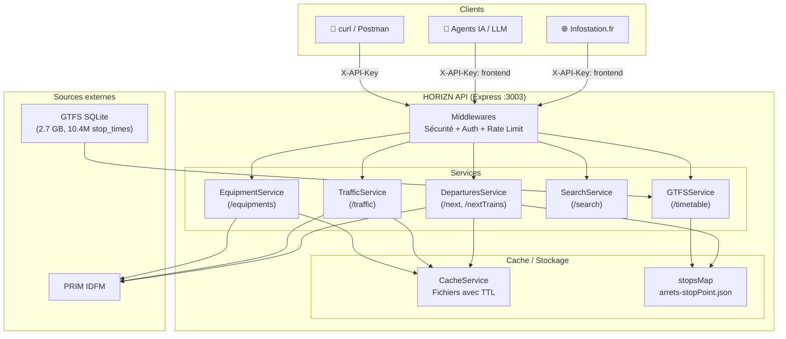
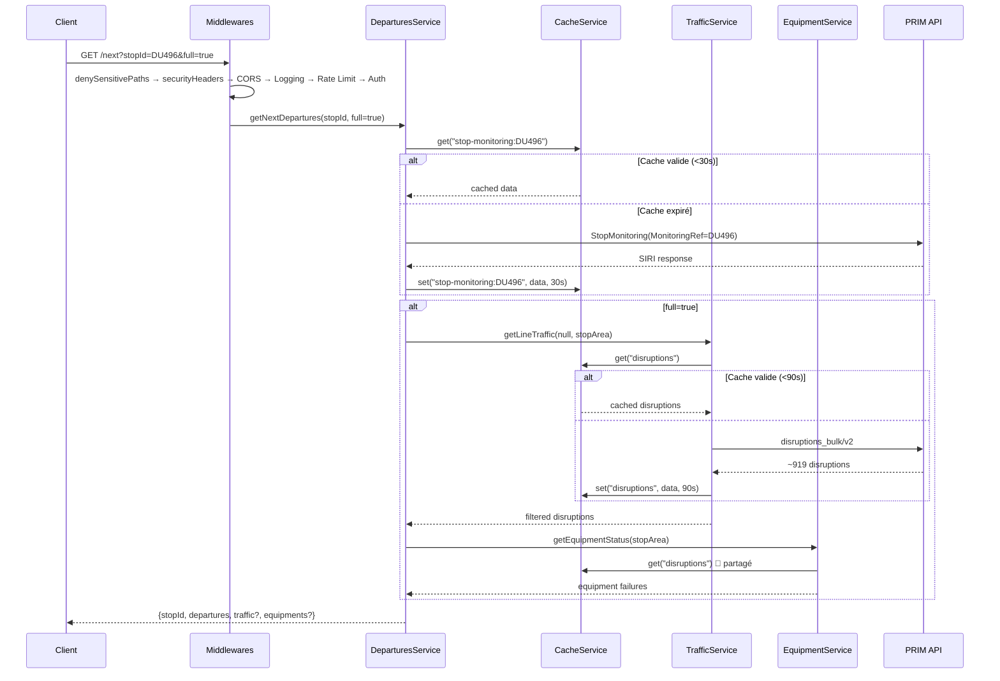
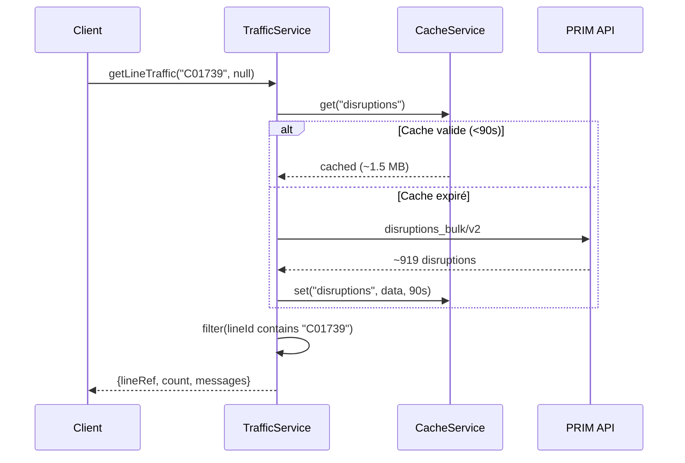

# HORIZN — Architecture & Flux

---

## 1. Arborescence du projet

```
HORIZN/
├── js/
│   ├── index.js                    ← Point d'entrée Express, routes, graceful shutdown
│   ├── middleware/
│   │   ├── auth.js                 ← API keys (frontend/admin) + JWT
│   │   ├── rateLimit.js            ← Rate limiting par route
│   │   └── security.js             ← Fichiers sensibles + headers sécurité
│   ├── services/
│   │   ├── CacheService.js         ← Cache fichier avec TTL
│   │   ├── DeparturesService.js    ← Fusion GTFS + PRIM StopMonitoring
│   │   ├── GTFSService.js          ← SQLite GTFS statique
│   │   ├── TrafficService.js       ← disruptions_bulk → filtré par lineRef/stopId
│   │   ├── EquipmentService.js     ← disruptions_bulk → filtres équipements
│   │   ├── SearchService.js        ← Recherche d'arrêts par nom
│   │   ├── LoggerService.js        ← Logs JSON lines journaliers
│   │   └── AdminService.js         ← Stats, cache, health, logs
│   └── scripts/
│       ├── setupGTFS.js            ← Import GTFS IDFM (hash checking, swap atomique)
│       ├── keys.js                 ← Gestionnaire de clés API
│       └── migrateStops.js         ← Migration arrêts
├── json/
│   └── arrets-stopPoint.json       ← Référentiel des arrêts (~18 Mo, .gitignoré)
├── data/
│   ├── infostation.db              ← DB GTFS (2.7 GB)
│   ├── api_keys.json               ← Clés API managées
│   └── logs/                       ← Logs JSON lines (YYYY-MM-DD.jsonl)
├── db/
│   └── schema.sql                  ← Schéma SQLite GTFS
├── docs/
│   └── ARCHITECTURE.md             ← Ce fichier
├── Dockerfile
├── docker-compose.yml
├── .env.example
├── README.md
├── AGENT.md
├── CLAUDE.md
├── CHANGELOG.md
└── package.json
```

---

## 2. Middleware stack (ordre d'exécution)

```
1. denySensitivePaths   ← Bloque fichiers sensibles (.env, api_keys.json, .*)
2. securityHeaders       ← X-Content-Type-Options, X-Frame-Options, Cache-Control
3. CORS                  ← Restriction d'origine (infostation.fr, beta.infostation.fr)
4. Request ID            ← X-Request-ID (généré ou transmis)
5. Logging               ← JSON lines (LoggerService)
6. Rate Limiting         ← Par route (rateLimitPublic, rateLimitSearch, rateLimitNext, rateLimitAdmin)
7. Auth                  ← requireFrontend / requireAdmin (API keys + JWT)
8. Route handlers         ← /next, /traffic, /search, /equipments, /timetable, /status, /admin/*
```

---

## 3. Flux de données

### 3.1 Diagramme général



### 3.2 Flux détaillé : `/next?stopId=DU496&full=true`



### 3.3 Flux détaillé : `/traffic?lineRef=C01739`



---

## 4. Services détaillés

### 4.1 CacheService.js

Cache fichier persistant avec TTL. Survit aux rebuilds Docker (volume monté).

```javascript
get(key)          → data || null
set(key, data, ttlSeconds) → void
```

**Caches actifs :**

| Clé | Données | TTL | Type |
|-----|---------|-----|------|
| `stop-monitoring:{stopId}` | Réponse PRIM StopMonitoring | 30s | Fichier |
| `disruptions` | Dataset complet disruptions_bulk | 90s | Fichier |
| `equipments` | Alias → disruptions | 90s | Partagé |
| `search:{query}` | Résultats recherche | 24h | Fichier |

### 4.2 DeparturesService.js

Fusionne données temps réel (PRIM StopMonitoring) et GTFS statique.

**Algorithme :**
1. Récupérer départs PRIM via StopMonitoring
2. Compléter avec horaires GTFS si `includeGTFS`
3. Fusionner (temps réel prioritaire)
4. Trier par heure de départ
5. Enrichir avec infos d'arrêt (nom, géopoint, accessibilité)

### 4.3 TrafficService.js

Récupère les perturbations depuis `disruptions_bulk/disruptions/v2` et filtre côté serveur.

**Filtres :**
- `lineRef` → filtre par `impactedSections[].lineId`
- `stopId` → filtre par `impactedSections[].stopArea.id`

### 4.4 EquipmentService.js

Extrait les pannes d'équipements depuis le même dataset `disruptions_bulk`.

**Types détectés :** `ESCALATOR`, `ELEVATOR`, `TRAIN_ACCESS`, `PARKING`, `OTHER`

### 4.5 SearchService.js

Recherche d'arrêts/gares par nom.

**Paramètres :** `q` (min 2 caractères), `count` (max 50). Cache 24h.

### 4.6 GTFSService.js

Accès aux horaires GTFS stockés dans SQLite (2.7 GB, 10.4M stop_times).

- `getDayTimetable(stopId, date)` → tous les passages de la journée
- `isAvailable()` → vérifie que la base est chargée
- Import : `npm run setup-gtfs` (cron 08:05, 13:05, 17:05)

### 4.7 LoggerService.js

Logs JSON lines dans `data/logs/YYYY-MM-DD.jsonl`.

Champs : `ts`, `reqId`, `method`, `path`, `query`, `status`, `duration`, `ip`, `ua`.

### 4.8 AdminService.js

Stats, logs, cache, health pour les routes admin.

- `getTodaysStats()` → total reqs, erreurs, avg/max/min duration, byPath
- `getRecentLogs(limit, since)` → dernières entrées de logs
- `queryLogs({path, statusMin, statusMax, durationMin, limit})` → logs filtrés
- `getCacheStatus()` → état du cache fichier (taille, âge, fichiers)
- `getHealth()` → uptime, GTFS disponible

---

## 5. Authentification

### Deux sources (cumulatives)

1. **`.env`** — `FRONTEND_API_KEY`, `ADMIN_API_KEY` (fallback)
2. **`data/api_keys.json`** — clés managées via `npm run keys`

Le middleware auth recharge le fichier à chaud si modifié (stat check).

### Niveaux

| Niveau | Accès |
|--------|-------|
| `frontend` | Routes publiques |
| `admin` | Routes admin + publiques |

---

## 6. Sécurité

### Fichiers protégés

Tout path avec `.env`, `api_keys.json`, `package.json`, `.*`, `..` → 403 avant toute route.

### Headers

- `X-Content-Type-Options: nosniff`
- `X-Frame-Options: DENY`
- `Cache-Control: no-store`
- `Referrer-Policy: strict-origin-when-cross-origin`

### Graceful shutdown

```
SIGTERM → stop accept new connections → wait in-flight → close DB → exit (timeout 10s)
```

---

## 7. Déploiement

### Docker

```bash
docker compose up -d horizn
```

- Image : `node:20-alpine`
- Volume mounts : `json` (ro), `data` (rw), `js/cache` (rw), `.env` (ro)
- Network : `heartbeat-net` (external)
- HEALTHCHECK : `GET :3003/health` toutes les 30s, 3 retries

### Cloudflare Tunnel

```
hostname: dev-horizn.infostation.fr → http://horizn:3003
hostname: isa.infostation.fr        → http://horizn:3003 (à venir)
```

---

## 8. GTFS

### Import

```bash
docker exec horizn node js/scripts/setupGTFS.js
```

- Téléchargement si ZIP > 24h
- Hash SHA256 (streaming) pour détecter les changements
- Skip si inchangé (0.2s)
- Import full : ~40s pour 10.4M stop_times (~1,9 GB) — mono-thread, ~260 Mo RSS
- Swap atomique (`*.tmp` + `renameSync`) : 0 downtime
- Le hash n'est écrit qu'après succès : un run interrompu est rejoué

#### Profil de charge (mesuré, jeu synthétique 9M lignes)

| | avant | après |
|---|---|---|
| Wall | 134 s | 41 s |
| CPU | 141 s | 43 s |
| Pic RSS | 620 Mo | 264 Mo |
| Taille DB | 1431 Mo | 988 Mo |

L'import n'utilise qu'**un seul cœur** (~1,05 mesuré) : ce n'est pas un traitement
parallèle. La RAM ne croît plus avec le nombre de lignes (cache SQLite borné à
64 Mo + `temp_store=FILE`), donc pas de risque d'OOM quand IDFM grossit.

Le coût dominant était la maintenance des index pendant le chargement : `schema.sql`
créait les index sur `stop_times` **avant** l'insertion (2 insertions B-tree
aléatoires × 10,4M lignes = 66 % du temps). Ils sont désormais construits une seule
fois après le chargement, par `createIndexes()`.

### Cron

```
5 8,13,17 * * *
```

Lancé en détaché (`docker exec -d`) — retour immédiat, pas de timeout.

⚠️ Le garde-fou « ZIP > 24h » de `downloadIfStale()` fait que **seul le run de 8h05
travaille réellement** : à 13h05 et 17h05 le ZIP local a moins de 24h, aucun
téléchargement n'a lieu, le hash est identique et l'import est skippé (0,2s).
La fréquence effective est donc de 1 import/jour, à l'heure de pointe du matin.

---

## 9. Codes HTTP

| Code | Condition |
|------|-----------|
| `200` | Succès |
| `400` | Paramètre manquant/invalide |
| `401` | Auth requise (`X-API-Key` manquant ou invalide) |
| `403` | Fichier sensible / origine non autorisée |
| `404` | Données introuvables / route inexistante |
| `429` | Rate limit dépassé |
| `500` | Erreur interne |
| `502` | Erreur API externe (PRIM) |
| `503` | Base GTFS non chargée |
