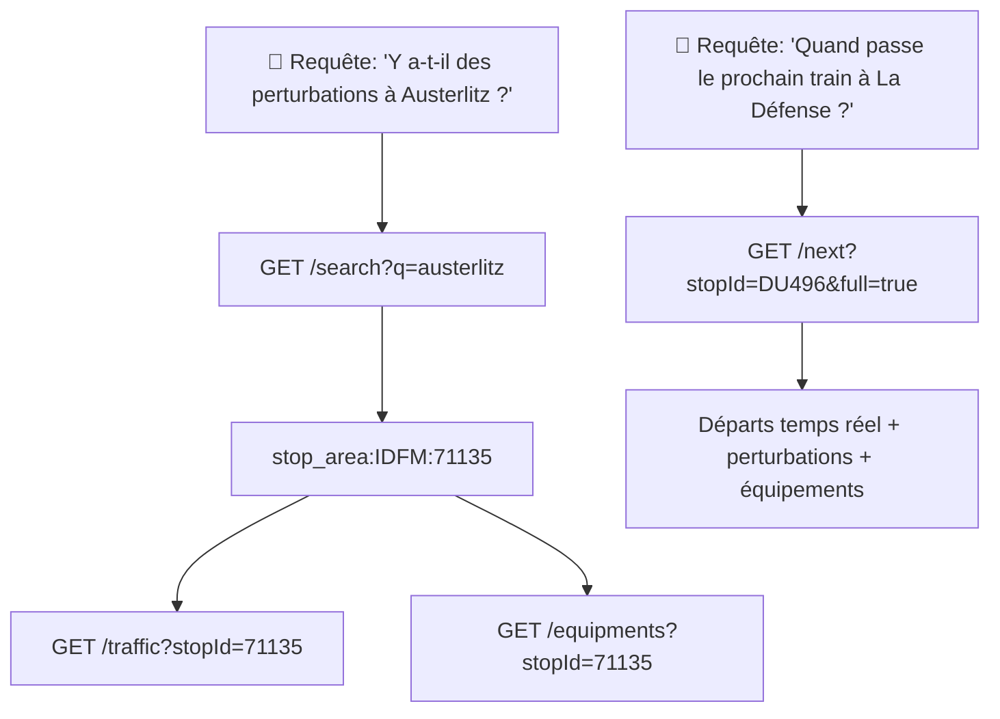

# HORIZN — Référence Géo & Données

---

## 1. Systèmes de coordonnées

HORIZN manipule **deux systèmes de coordonnées** pour géolocaliser les arrêts.

| Système | Code EPSG | Usage | Précision |
|---------|-----------|-------|-----------|
| **WGS84** | `EPSG:4326` | API / GeoJSON / Leaflet / LLM | Degrés décimaux (lon, lat) |
| **Lambert 93** | `EPSG:2154` | Référentiel IDFM / fichiers historiques | Mètres (X, Y) |

### Conversion WGS84 ↔ Lambert 93

```javascript
// WGS84 → Lambert 93 (approximation, proj4js)
proj4('EPSG:4326', 'EPSG:2154', [2.365, 48.843])
// → [652843.12, 6863054.89] (Gare d'Austerlitz)

// Lambert 93 → WGS84
proj4('EPSG:2154', 'EPSG:4326', [652843, 6863055])
// → [2.365, 48.843]
```

**Référence :** RGF93 / Lambert-93 — système légal français depuis 2000 (décret 2000-1276).

---

## 2. Systèmes d'identifiants

Le réseau IDFM utilise **4 systèmes d'IDs** différents selon le contexte. HORIZN assure la passerelle entre eux.

### 2.1 LineRef — Identifiants de ligne

```
Format PRIM SIRI :   STIF:Line::C0XXXX:
Format Navitia :     line:IDFM:C0XXXX
Format court :       C0XXXX
```

**Table complète des lignes :**

#### Métro (RATP)

| Ligne | LineRef court | LineRef complet |
|-------|--------------|-----------------|
| Métro 1 | `C01361` | `STIF:Line::C01361:` |
| Métro 2 | `C01362` | `STIF:Line::C01362:` |
| Métro 3 | `C01363` | `STIF:Line::C01363:` |
| Métro 3bis | `C01371` | `STIF:Line::C01371:` |
| Métro 4 | `C01374` | `STIF:Line::C01374:` |
| Métro 5 | `C01375` | `STIF:Line::C01375:` |
| Métro 6 | `C01376` | `STIF:Line::C01376:` |
| Métro 7 | `C01377` | `STIF:Line::C01377:` |
| Métro 7bis | `C01372` | `STIF:Line::C01372:` |
| Métro 8 | `C01378` | `STIF:Line::C01378:` |
| Métro 9 | `C01373` | `STIF:Line::C01373:` |
| Métro 10 | `C01379` | `STIF:Line::C01379:` |
| Métro 11 | `C01380` | `STIF:Line::C01380:` |
| Métro 12 | `C01381` | `STIF:Line::C01381:` |
| Métro 14 | `C01384` | `STIF:Line::C01384:` |
| Métro 15 | `C01385` | `STIF:Line::C01385:` |
| Métro 16 | `C01386` | `STIF:Line::C01386:` |
| Métro 17 | `C01387` | `STIF:Line::C01387:` |
| Métro 18 | `C01388` | `STIF:Line::C01388:` |

#### RER

| Ligne | LineRef court | Réseau |
|-------|--------------|--------|
| RER A | `C01742` | RATP |
| RER B | `C01726` | RATP + SNCF |
| RER C | `C01727` | SNCF |
| RER D | `C01728` | SNCF |
| RER E | `C01732` | SNCF |

#### Tramway

| Ligne | LineRef court | Réseau |
|-------|--------------|--------|
| T1 | `C01947` | RATP |
| T2 | `C01948` | RATP |
| T3a | `C01949` | RATP |
| T3b | `C01950` | RATP |
| T5 | `C01951` | RATP |
| T6 | `C01952` | RATP |
| T7 | `C01953` | RATP |
| T8 | `C01954` | RATP |
| T9 | `C01955` | RATP |
| T10 | `C01956` | RATP |
| T11 | `C01958` | SNCF |
| T12 | `C01959` | SNCF |
| T13 | `C01960` | SNCF |

#### Transilien (SNCF)

| Ligne | LineRef court |
|-------|--------------|
| Transilien H | `C01737` |
| Transilien J | `C01739` |
| Transilien K | `C01738` |
| Transilien L | `C01740` |
| Transilien N | `C01736` |
| Transilien P | `C01730` |
| Transilien R | `C01731` |
| Transilien U | `C01741` |

**Source :** `referentiel-des-lignes` sur [data.iledefrance-mobilites.fr](https://data.iledefrance-mobilites.fr)

---

### 2.2 StopId (zdaid) — Arrêts pour départs temps réel

```
Format PRIM SIRI :   STIF:StopArea:SP:XXXXX:
Format court :       XXXXX
```

Utilisé par `GET /next`.

| Exemples | zdaid | Arrêt |
|----------|-------|-------|
| `DU496` | La Défense (Grande Arche) |
| `58449` | Mairie |
| `DU480` | Nanterre-Préfecture |
| `DU487` | Gare de Lyon |
| `DU492` | Châtelet - Les Halles |

**Source :** fichier `arrets-stopPoint.json` (~18 Mo, ~30 000 arrêts). Champs :

```json
{
  "zdaid": "DU496",
  "arrname": "La Défense (Grande Arche)",
  "arrnametype": "VIA",
  "arradmin": "92050",
  "arrcommune": "Puteaux",
  "arrinsee": "92050",
  "arrdepartement": "92",
  "arrgeopoint": { "lon": 2.238, "lat": 48.892 },
  "arracode": "8775800",
  "arrwebrefg": "http://...",
  "arrxepsg2154": 649032.3,
  "arryepsg2154": 6870000.0,
  "arraccessibility": true,
  "arrscreen": "NIV",
  "arrtarifzone": "3",
  "arrtransporter": "TRANSILIEN",
  "arruic": "8775800",
  "arr_url_pcd": "",
  "arrufi": null,
  "arrvs": null
}
```

**Schéma complet `arrets-stopPoint.json` :**

| Champ | Type | Description |
|-------|------|-------------|
| `zdaid` | `string` | Identifiant unique de l'arrêt (clé primaire) |
| `arrname` | `string` | Nom commercial de l'arrêt |
| `arrnametype` | `string` | Type de nom (`VIA`, `GARE`, `STATION`, `ARRET`) |
| `arradmin` | `string` | Code administratif |
| `arrcommune` | `string` | Nom de la commune |
| `arrinsee` | `string` | Code INSEE de la commune |
| `arrdepartement` | `string` | Numéro du département |
| `arrgeopoint.lon` | `number` | Longitude WGS84 (degrés décimaux) |
| `arrgeopoint.lat` | `number` | Latitude WGS84 (degrés décimaux) |
| `arracode` | `string` | Code d'identification UIC |
| `arrwebrefg` | `string` | URL de référence |
| `arrxepsg2154` | `number` | Coordonnée X en Lambert 93 (mètres) |
| `arryepsg2154` | `number` | Coordonnée Y en Lambert 93 (mètres) |
| `arraccessibility` | `boolean` | Accessibilité PMR |
| `arrscreen` | `string` | Type d'affichage (`NIV`, `VAR`) |
| `arrtarifzone` | `string` | Zone tarifaire Navigo (1-5) |
| `arrtransporter` | `string` | Opérateur de l'arrêt |
| `arruic` | `string` | Code UIC international |
| `arr_url_pcd` | `string` | URL plan de chalandise |
| `arrufi` | `string` | Identifiant UFI (nullable) |
| `arrvs` | `string` | Identifiant VS (nullable) |

---

### 2.3 StopArea — Arrêts pour perturbations

```
Format disruptions_bulk :   stop_area:IDFM:XXXXX
Format court accepté :      XXXXX
```

Utilisé par `GET /traffic?stopId=X` et `GET /equipments?stopId=X`.

| Exemples | StopArea | Arrêt |
|----------|----------|-------|
| `71135` | Gare d'Austerlitz |
| `478505` | Juvisy |
| `8754513` | Saint-Lazare |
| `8727107` | Gare de Lyon |
| `8733803` | Montparnasse |

**Source :** SIRI `disruptions_bulk` — retourné par `GET /search`.

### 2.4 Relation zdaid ↔ StopArea

**Il n'y a pas de correspondance directe garantie** entre les deux systèmes.

| Système | Usage | Exemple | Format |
|---------|-------|---------|--------|
| zdaid | Prochains départs (`/next`) | `DU496` | 5-6 caractères alphanum |
| stop_area:IDFM | Perturbations (`/traffic`), équipements | `71135` | 5-9 chiffres |

**Stratégie de résolution :**

```mermaid
graph LR
    A[Nom d'arrêt] --> B[/search]
    B --> C[stop_area:IDFM:X]
    B --> D[zdaid via fichier arrets-stopPoint.json]
    C --> E[/traffic]
    C --> F[/equipments]
    D --> G[/next]
```

---

## 3. Données géographiques

### 3.1 Couverture géographique

| Réseau | Opérateur | Couverture | Endpoint |
|--------|-----------|------------|----------|
| Métro | RATP | ~308 stations, 16 lignes | `/next`, `/traffic` |
| RER | RATP + SNCF | ~257 gares, 5 lignes | `/next`, `/traffic` |
| Tramway | RATP + SNCF | ~278 arrêts, 13 lignes | `/next`, `/traffic` |
| Transilien | SNCF | ~292 gares, 9 lignes | `/next`, `/traffic` |
| Bus | RATP + Optile | ~14 000 arrêts | `/next` (partiel) |
| Noctilien | RATP | Bus de nuit | `/next` (partiel) |

### 3.2 Zones tarifaires Navigo

| Zone | Couverture | Exemples |
|------|-----------|----------|
| 1 | Paris intra-muros | Châtelet, Saint-Lazare |
| 2 | Petite couronne proche | Montreuil, Boulogne |
| 3 | Petite couronne | Puteaux (La Défense), Saint-Denis |
| 4 | Grande couronne proche | Versailles, Roissy |
| 5 | Grande couronne | Mantes-la-Jolie, Meaux |

Champ `arrtarifzone` dans le fichier arrêts.

### 3.3 Codes INSEE des communes

Le champ `arrinsee` fournit le code INSEE (5 chiffres) de chaque arrêt.

```json
// Exemple : Gare d'Austerlitz
{ "arrinsee": "75056", "arrcommune": "Paris", "arrdepartement": "75" }
// La Défense
{ "arrinsee": "92050", "arrcommune": "Puteaux", "arrdepartement": "92" }
```

---

## 4. Cache réseau

HORIZN met en cache les appels PRIM pour éviter les sur-sollicitations.

| Endpoint | API PRIM | TTL | Taille typique | Stratégie |
|----------|----------|-----|----------------|-----------|
| `/next` | StopMonitoring | 60s | ~5-50 Ko | Cache mémoire, invalidé par temps |
| `/traffic` | disruptions_bulk | 5 min | ~1.5 Mo | Cache partagé Traffic + Equipments |
| `/equipments` | disruptions_bulk | 5 min | — | Même cache que `/traffic` |
| `/search` | Navitia places | aucun | — | Pas de cache (recherche temps réel) |
| `/timetable` | GTFS local (SQLite) | fichier | dépend du dataset | Fichier statique sur disque |

**Important :** le cache est en mémoire (Map Node.js). Un redémarrage du service vide tous les caches.

---

## 5. Quotas PRIM

L'API PRIM Île-de-France Mobilités applique des quotas :

| Type de token | Limite | Usage HORIZN |
|---------------|--------|-------------|
| **Ancien token** (avant mars 2024) | 15 req/s, 20 000 req/jour | ✅ Confortable |
| **Nouveau token** | 5 req/s, 1 000 req/jour | ⚠️ Nécessite cache |

Avec le cache 5 min sur `disruptions_bulk` + 60s sur StopMonitoring, HORIZN reste sous **5 req/min** pour un usage normal.

---

## 6. Cas particulier : Lignes SNCF vs RATP

### Perturbations

| Source | API | Couverture |
|--------|-----|------------|
| **RATP** | `general-message` (obsolète) | Métro, RER A, Tramway RATP |
| **SNCF + RATP** | `disruptions_bulk/disruptions/v2` | **Toutes les lignes** (919 perturbations au total) |

### Prochains passages

| Source | API | Couverture |
|--------|-----|------------|
| StopMonitoring (PRIM) | Temps réel | Toutes lignes RATP + SNCF |
| GTFS statique | Fichier local | Toutes lignes (hors-ligne) |

---

## 7. Référence rapide pour agents IA

### Résumé des identifiants

```yaml
types_d_ids:
  lineRef:
    format_court: "C0XXXX"
    format_siri: "STIF:Line::C0XXXX:"
    format_navitia: "line:IDFM:C0XXXX"
    usage: "Perturbations par ligne (/traffic?lineRef=)"

  stopId_zdaid:
    format: "DUXXX"  # 5-6 caractères alphanum
    usage: "Prochains départs (/next?stopId=)"
    source: "arrets-stopPoint.json → zdaid"

  stopArea:
    format: "stop_area:IDFM:XXXXX"  # ou XXXXX seul
    usage: "Perturbations & équipements (/traffic?stopId=, /equipments?stopId=)"
    source: "Navitia places (/search)"

  coordonnees:
    wgs84_lon: 2.365
    wgs84_lat: 48.843
    lambert93_x: 652843
    lambert93_y: 6863055
```

### Parcours types pour agents



### Prompt template pour LLM

```markdown
## Contexte transport IDF

Tu as accès à l'API HORIZN.
Pour un **nom d'arrêt**, appelle d'abord `/search?q={nom}` pour obtenir le `stop_area:IDFM:X`.
Tu peux aussi chercher le `zdaid` dans le fichier `arrets-stopPoint.json` pour `/next`.

**Endpoints disponibles :**
- `/next?stopId=DU496` → Prochains passages temps réel
- `/next?stopId=DU496&full=true` → Idem + perturbations + équipements
- `/traffic?lineRef=C01739` → Perturbations par ligne
- `/traffic?stopId=71135` → Perturbations à un arrêt
- `/equipments?stopId=71135` → Pannes ascenseurs/escalators
- `/search?q=austerlitz` → Recherche d'arrêts
- `/timetable?stopId=DU496&date=2026-06-10` → Horaires complets journée

**Formats d'IDs :**
- Lignes : `C0XXXX` (ex: C01739 = Transilien J, C01361 = Métro 1)
- Arrêts pour départs : `DUXXX` (zdaid, ex: DU496 = La Défense)
- Arrêts pour trafic : `stop_area:IDFM:X` (ex: 71135 = Austerlitz)
```
