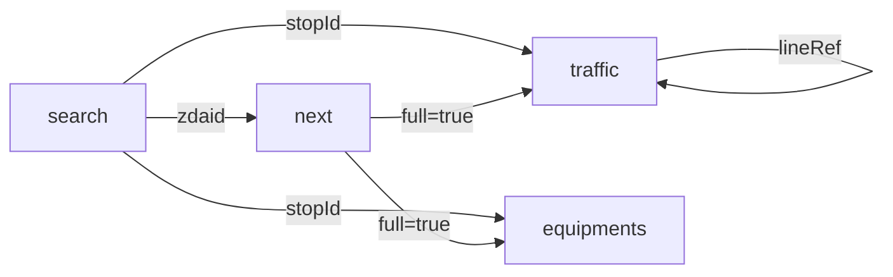

# HORIZN

**API temps réel Île-de-France Mobilités** — prochains passages, perturbations, équipements.

Une API Node.js/Express qui consolide **PRIM (SIRI + Navitia)**, **GTFS statique** et le fichier **référentiel des arrêts** en une interface unique, géo-intelligente.

---

## 🔥 Quick Start

```bash
npm install
cp .env.example .env   # configure PRIM_API_KEY
npm run setup-gtfs      # optionnel: hors-ligne GTFS
node js/index.js
```

```
GET http://localhost:3000/next?stopId=DU496
GET http://localhost:3000/next?stopId=DU496&full=true
GET http://localhost:3000/search?q=austerlitz
GET http://localhost:3000/traffic?lineRef=C01739
GET http://localhost:3000/equipments?stopId=71135
```

---

## 📡 Endpoints

### `GET /next` | `GET /nextTrains`

Prochains passages temps réel (PRIM StopMonitoring) + horaires GTFS fusionnés.

**Paramètres :**

| Param | Type | Défaut | Description |
|-------|------|--------|-------------|
| `stopId` | `string` | **requis** | ID zdaid de l'arrêt (ex: `DU496` pour La Défense) |
| `stopArea` | `string` | =`stopId` | ID `stop_area:IDFM:X` pour les sections traffic/equipments |
| `full` | `bool` | `false` | Si `true`, inclut `traffic` + `equipments` |
| `horizon` | `number` | `5` | Fenêtre en heures (max `12`) |
| `includeGTFS` | `bool` | `true` | Ajouter les horaires GTFS statiques |

**Exemple :**

```bash
curl "http://localhost:3000/next?stopId=DU496&full=true&horizon=2"
```

```json
{
  "stopId": "DU496",
  "stopName": "La Défense (Grande Arche)",
  "geopoint": { "lon": 2.238, "lat": 48.892 },
  "horizon": 2,
  "departures": [
    {
      "line": "STIF:Line::C01739:",
      "destination": "Mantes-la-Jolie",
      "quai": "Voie L",
      "times": {
        "scheduled": { "departure": "2026-06-10T14:12:00+02:00" },
        "realtime":  { "departure": "2026-06-10T14:12:00+02:00" }
      },
      "status": "onTime"
    }
  ],
  "traffic": {
    "count": 2,
    "messages": [...]
  },
  "equipments": {
    "count": 0,
    "equipments": []
  }
}
```

**Champs `departures[].status` :**

| Valeur | Signification |
|--------|---------------|
| `onTime` | À l'heure |
| `delayed` | Retard |
| `cancelled` | Supprimé |
| `departed` | Parti |
| `arrived` | Arrivé |
| `noData` | Statut inconnu |

---

### `GET /timetable`

Horaires GTFS statiques complets pour une journée entière.

**Paramètres :**

| Param | Type | Défaut | Description |
|-------|------|--------|-------------|
| `stopId` | `string` | **requis** | ID zdaid de l'arrêt |
| `date` | `string` | aujourd'hui | Format `YYYY-MM-DD` |

```bash
curl "http://localhost:3000/timetable?stopId=DU496&date=2026-06-10"
```

---

### `GET /traffic`

Perturbations trafic par ligne et/ou par arrêt.

**Paramètres :**

| Param | Type | Défaut | Description |
|-------|------|--------|-------------|
| `lineRef` | `string` | — | ID technique IDFM (`C01739`, `C01371`) |
| `stopId` | `string` | — | `stop_area:IDFM:X` ou `X` seul |

**Combinaisons :**

| Requête | Résultat |
|---------|----------|
| `?lineRef=C01739` | Perturbations du Transilien J |
| `?stopId=71135` | Toutes les perturbations à Gare d'Austerlitz |
| `?lineRef=C01739&stopId=71135` | Intersection : J **et** Austerlitz |

```bash
curl "http://localhost:3000/traffic?lineRef=C01739"
```

```json
{
  "lineRef": "C01739",
  "count": 12,
  "messages": [
    {
      "id": "3664a2ce-...",
      "title": "Ligne J : mouvement social national le mercredi 10 juin",
      "cause": "PERTURBATION",
      "severity": "PERTURBEE",
      "applicationPeriods": [
        { "begin": "20260610T030000", "end": "20260611T025000" }
      ],
      "impactedSections": [
        {
          "lineId": "line:IDFM:C01739",
          "fromName": "Gare Saint-Lazare (Paris)",
          "toName": "Poissy (Poissy)"
        }
      ]
    }
  ]
}
```

**Valeurs `severity` :** `BLOQUANTE`, `PERTURBEE`, `INFORMATION`

**Valeurs `cause` :** `TRAVAUX`, `PERTURBATION`, `INFORMATION`

---

### `GET /search`

Recherche d'arrêts/gares par nom (via Navitia places).

**Paramètres :**

| Param | Type | Défaut | Description |
|-------|------|--------|-------------|
| `q` | `string` | **requis** | Texte (min 2 car.) |
| `count` | `int` | `10` | Max résultats (max `50`) |

```bash
curl "http://localhost:3000/search?q=austerlitz&count=3"
```

```json
{
  "query": "austerlitz",
  "count": 3,
  "results": [
    {
      "id": "stop_area:IDFM:71135",
      "name": "Gare d'Austerlitz (Paris)",
      "stopArea": {
        "name": "Gare d'Austerlitz",
        "label": "Gare d'Austerlitz (Paris)",
        "city": "Paris",
        "coord": { "lon": 2.365, "lat": 48.843 }
      }
    }
  ]
}
```

**Parcours type IA :** `search → next` ou `search → traffic`

```
/search?q=austerlitz  →  stop_area:IDFM:71135  →  /traffic?stopId=71135
                                                    /next?stopId=DU496&full=true
```

---

### `GET /equipments`

Pannes d'équipements (ascenseurs, escalators) filtrées depuis disruptions_bulk.

**Paramètres :**

| Param | Type | Défaut | Description |
|-------|------|--------|-------------|
| `stopId` | `string` | — | Optionnel : `stop_area:IDFM:X` |

```bash
curl "http://localhost:3000/equipments?stopId=71135"
```

---

## 🗺️ Géo-référencement (GEO)

### Identifiants de transport

Chaque entité du réseau IDFM possède plusieurs IDs selon le contexte :

| Entité | Format PRIM | Exemple |
|--------|-------------|---------|
| **Ligne** | `line:IDFM:C0XXXX` / `STIF:Line::C0XXXX:` | `C01739` = Transilien J |
| **Arrêt (zdaid)** | `STIF:StopArea:SP:XXXX:` | `DU496` = La Défense |
| **Arrêt (stop_area)** | `stop_area:IDFM:XXXXX` | `71135` = Gare d'Austerlitz |
| **Gare/Station** | `stop_area:IDFM:XXXXX` | `478505` = Juvisy |

### Codes lignes par réseau

```yaml
RATP:
  Métro 1:   C01371
  Métro 2:   C01372
  Métro 4:   C01374
  Métro 14:  C01384
  RER A:     C01742
  Tram T1:   C01947

SNCF / Transilien:
  RER C:     C01727
  RER D:     C01728
  Transilien H: C01737
  Transilien J: C01739
  Transilien K: C01738
  Transilien L: C01740
  Transilien N: C01736
  Transilien P: C01730
  Transilien R: C01731
  Transilien U: C01741
```

### Sources des données

| Source | Coverage | Endpoint | Cache |
|--------|----------|----------|-------|
| **PRIM StopMonitoring** | Temps réel toutes lignes | `/marketplace/stop-monitoring` | 60s |
| **PRIM disruptions_bulk** | Toutes perturbations RATP+SNCF+bus | `/marketplace/disruptions_bulk/disruptions/v2` | 5 min |
| **Navitia places** | Recherche d'arrêts | `/marketplace/v2/navitia/places` | — |
| **GTFS statique** | Horaires théoriques hors-ligne | Fichier local SQLite | fichier |
| **Référentiel arrêts** | Infos géo (nom, ville, coords) | `arrets-stopPoint.json` | fichier |

---

## 🤖 IA-Friendly Design

L'API est conçue pour être consommée par des agents LLM :

- **Réponses auto-suffisantes** : chaque endpoint documente ses propres paramètres et retours
- **Identifiants cohérents** : `stop_area:IDFM:X` est réutilisé entre `/search`, `/traffic` et `/equipments`
- **Parcours en chaîne** : la réponse de `/search` fournit directement les IDs à passer aux autres endpoints
- **Cache transparent** : les délais de cache sont documentés pour que l'IA sache quand rafraîchir
- **Format ISO** : dates en `YYYYMMDDThhmmss` (SIRI) ou `YYYY-MM-DD` (GTFS)

### Parcours types pour agents LLM



---

## 🚀 Déploiement

```bash
# Variables d'environnement
export PRIM_API_KEY="votre-clé"
export STOPS_MAP_PATH="/srv/http/horizn/json/arrets-stopPoint.json"
export PORT=3000
export QUIET_MODE=true

# Démarrage
node js/index.js
```

**Proxy inverse (Apache / Nginx) :**

```apache
ProxyPass /horizn/ http://127.0.0.1:3000/
ProxyPassReverse /horizn/ http://127.0.0.1:3000/
```

---

## 🔐 Authentification

Tous les endpoints nécessitent une clé API PRIM valide, configurée via :

```env
PRIM_API_KEY="SA2gwXmU8tMANuVvb1cei7oQc3FjEGOQ"
```

La clé est injectée côté serveur — les clients n'ont pas besoin de clé.

**Restriction d'origine :** seuls `infostation.fr` et `beta.infostation.fr` sont autorisés (modifiable dans `index.js`).

---

## ⚙️ Build & Release

```bash
git clone https://github.com/leolesimple/HORIZN.git
cd HORIZN
npm install
# GTFS optionnel
npm run setup-gtfs
```

**Dépendances :** `express`, `axios`, `dotenv`, `better-sqlite3` (pour GTFS)

---

## 📦 Cache

| Niveau | Durée | Stockage | Clear |
|--------|-------|----------|-------|
| StopMonitoring | 60s | Mémoire | Automatique |
| disruptions_bulk | 5 min | Mémoire | Automatique |
| GTFS SQLite | fichier | Disque | `npm run setup-gtfs` |

---

## 📄 Licence

Projet privé — Léo Lesimple
